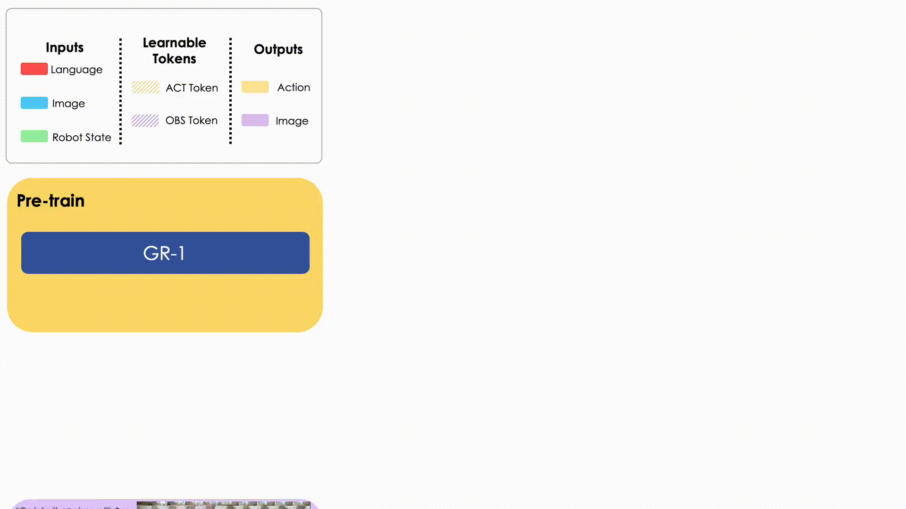

# GR-1
This repo contains code for the paper:
### Unleashing Large-Scale Video Generative Pre-training for Visual Robot Manipulation ###

[Project Website](https://gr1-manipulation.github.io/) || [Arxiv](https://arxiv.org/abs/2312.13139) || ICLR 2024

Hongtao Wu*, Ya Jing*, Chilam Cheang, Guangzeng Chen, Jiafeng Xu, Xinghang Li, Minghuan Liu, Hang Li, Tao Kong

\* indicates equal contribution.
<p align="center">

</p>

GR-1 is a GPT-style model designed for multi-task language-conditioned visual robot manipulation. GR-1 takes as inputs a language instruction, a sequence of observation images, and a sequence of robot states. It predicts robot actions as well as future images in an end-to-end manner.

<p align="center">

</p>

<p align="center">


</p>


## Abstract
Generative pre-trained models have demonstrated remarkable effectiveness in language and vision domains by learning useful representations. In this paper, we extend the scope of this effectiveness by showing that visual robot manipulation can significantly benefit from large-scale video generative pre-training. We introduce GR-1, a GPT-style model designed for multi-task language-conditioned visual robot manipulation. GR-1 takes as inputs a language instruction, a sequence of observation images, and a sequence of robot states. It predicts robot actions as well as future images in an end-to-end manner. Thanks to a flexible design, GR-1 can be seamlessly finetuned on robot data after pre-trained on a large-scale video dataset. We perform extensive experiments on the challenging CALVIN benchmark and a real robot. On CALVIN benchmark, our method outperforms state-of-the-art baseline methods and improves the success rate from 88.9% to 94.9%. In the setting of zero-shot unseen scene generalization, GR-1 improves the success rate from 53.3% to 85.4%. In real robot experiments, GR-1 also outperforms baseline methods and shows strong potentials in generalization to unseen scenes and objects. We provide inaugural evidence that a unified GPT-style transformer, augmented with large-scale video generative pre-training, exhibits remarkable generalization to multi-task visual robot manipulation.

## Installation
- Follow the installation steps in [the CALVIN repo](https://github.com/mees/calvin) to install the CALVIN environment.
- Download the CALVIN dataset from [the CALVIN repo](https://github.com/mees/calvin/blob/main/dataset/README.md).
- Install other dependencies:
```
bash install.sh
```

## CALVIN Benchmark Evaluation
- Download the MAE ViT-Base pre-trained weight from [the MAE repo](https://github.com/facebookresearch/mae). The link to the pre-trained weight is [here](https://dl.fbaipublicfiles.com/mae/pretrain/mae_pretrain_vit_base.pth).
- Download the GR-1 training weights: [ABCD-D split](https://lf-robot-opensource.bytetos.com/obj/lab-robot-public/gr1_code_release/snapshot_ABCD.pt), [ABC-D split](https://lf-robot-opensource.bytetos.com/obj/lab-robot-public/gr1_code_release/snapshot_ABC.pt). 
- Place the downloaded pre-trained weights ```snapshot_ABCD.pt``` and ```snapshot_ABC.pt``` in ```logs/```.
- Evaluate by running the following command. Specify the path to the calvin repo in ```CALVIN_ROOT```. Specify the directory to ABCD-D or ABC-D dataset in the command. For example, to evaluate the ABCD-D split:
    ```
    export CALVIN_ROOT=/path/to/calvin/directory/
    export EVAL_DIR=eval_logs/
    export POLICY_CKPT_PATH=logs/snapshot_ABCD.pt
    export MAE_CKPT_PATH=/path/to/mae/checkpoint/
    bash evaluate_calvin.sh --dataset_dir /path/to/calvin/dataset/task_ABCD_D/directory/
    ```
    ```EVAL_DIR``` will be created and evaluation results will be saved in it.
    To evaluate the ABC-D split, ```export POLICY_CKPT_PATH=logs/snapshot_ABC.pt```.

## Citation
If you find this code useful in your work, please consider citing
```shell
@inproceedings{wu2023unleashing,
  title={Unleashing Large-Scale Video Generative Pre-training for Visual Robot Manipulation},
  author={Wu, Hongtao and Jing, Ya and Cheang, Chilam and Chen, Guangzeng and Xu, Jiafeng and Li, Xinghang and Liu, Minghuan and Li, Hang and Kong, Tao},
  booktitle={International Conference on Learning Representations},
  year={2024}
}
```

## License
This project is licensed under the [Apache-2.0 License](LICENSE.txt).
